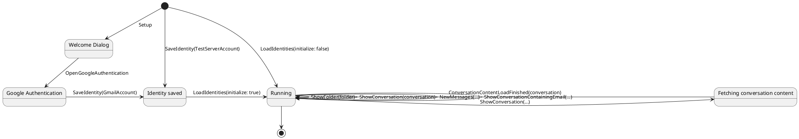

# Application states

The following plantuml diagram shows the different application states and the
different application messages that can be delivered and which state
transitions they can lead to.

As can be seen, application states are not very well defined: once the
application reaches the "Running" state, the state remains largely the same.
But the diagram clarifies well the different startup flows.

